# Personal-Information-Blog
This is Personal Information Blog, created as an Assignment.
The Personal Informtion Blog is made using HTML, CSS and JavaScript. 
The project uses two external Libraries namely, FullPage.js and Jquery.
The project is developed in Mobile First Design Strategy.
Below are the screenshots of the project

Homepage:
 
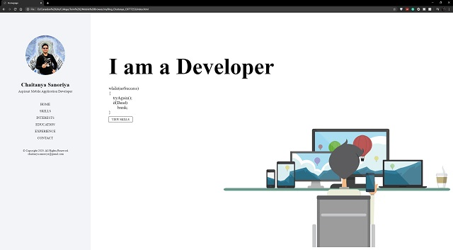
  
Navigation in Mobile:
 
  
Skills Page:
 
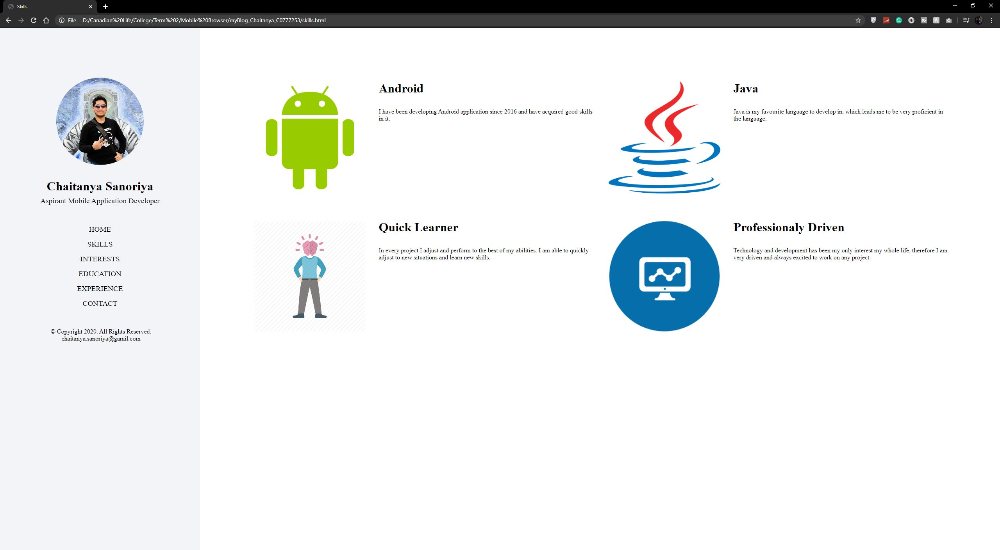
  
Interests Page:
 
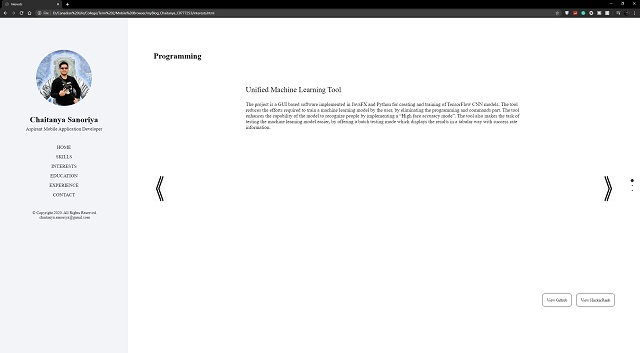
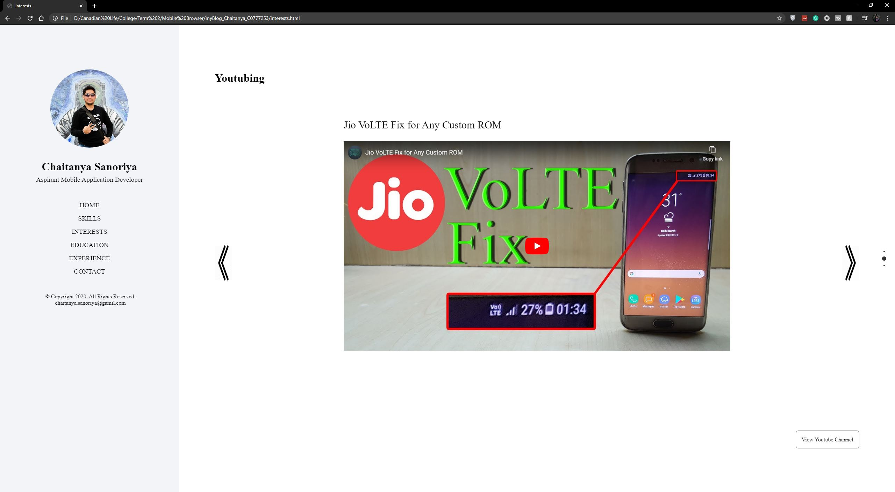
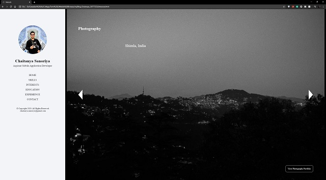

  
Education Page:
 
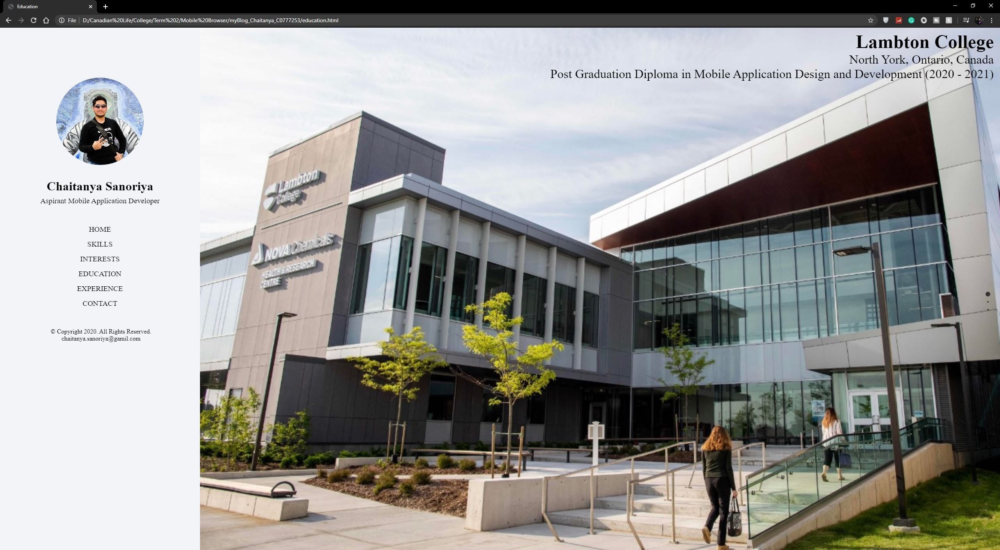
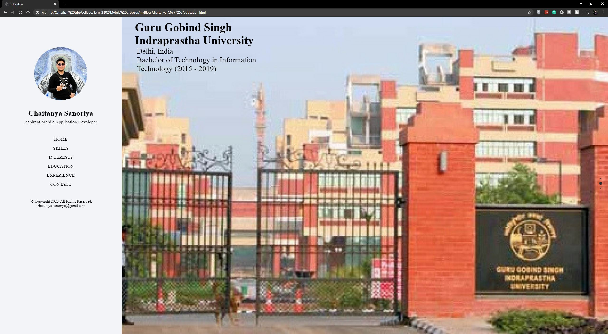
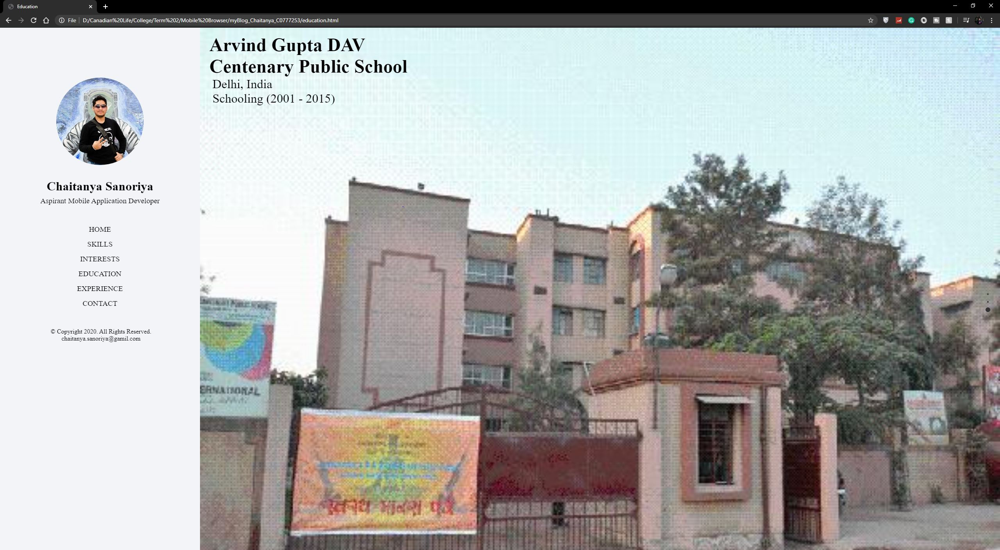

  
Expeience Page:
 
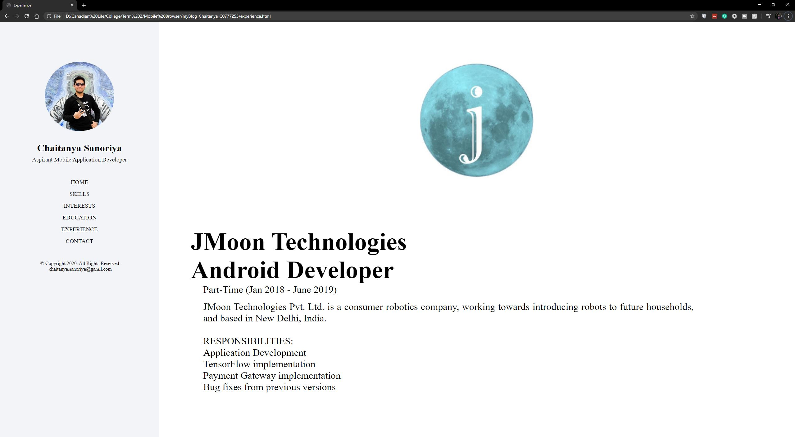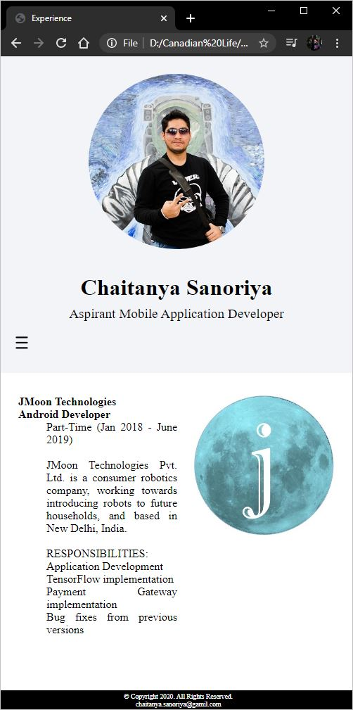
  
Contact Page:
 
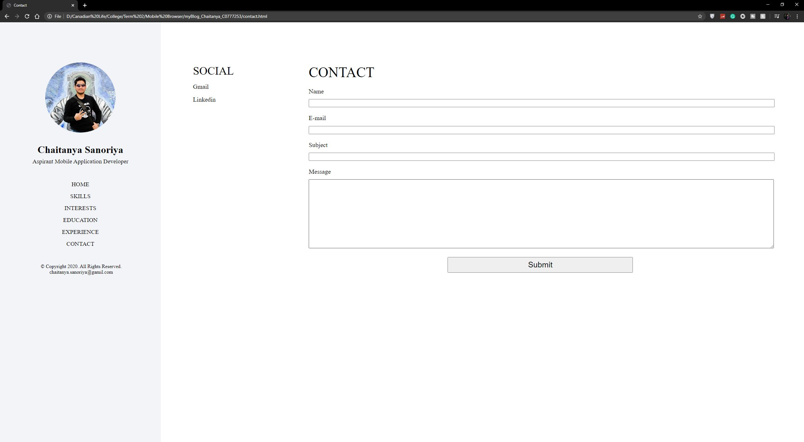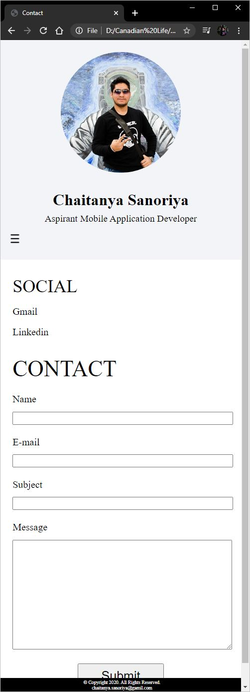
